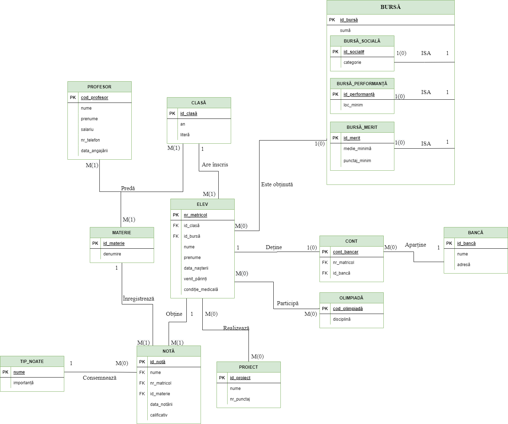
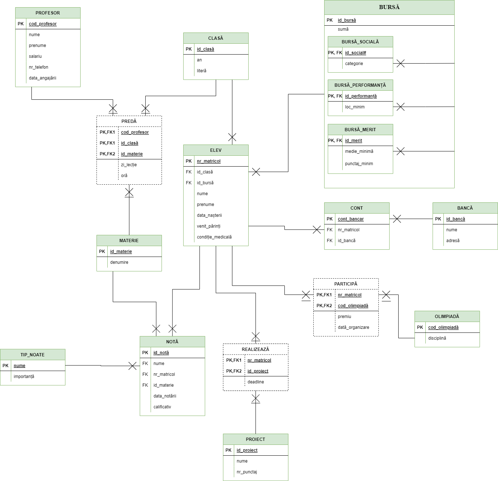

### Database Management System :bar_chart:
# Management-of-a-school-PL-SQL

**Asignment**
Design and implement using Oracle 11g/12c a relational database (at least 6 independent entities and one associative table).

**ER Diagram**

**Conceptual Diagram**

